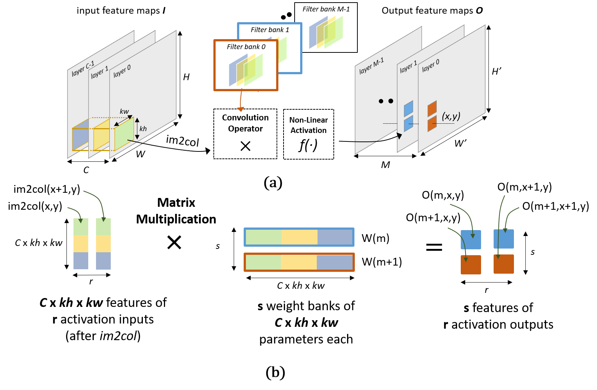
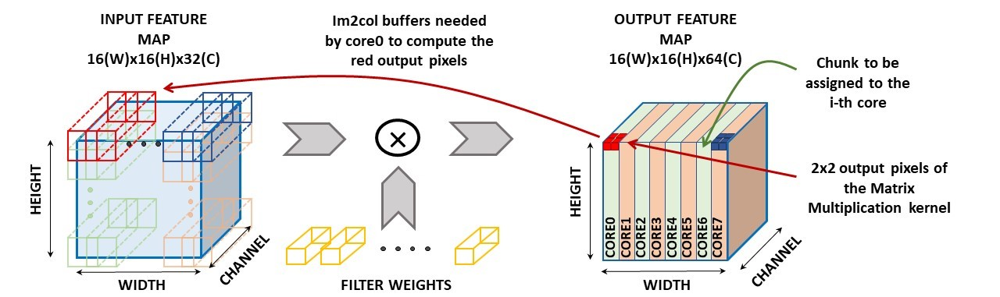

# PULP-NN: Enabling the QNN inference on PULP

PULP_NN is a multicore computing library for QNN inference on Parallel-Ultra-Low-Power (PULP) Clusters of RISC-V based processors. 
It adopts the Height-Width-Channel (HWC) layout to store NN weights and activations and the implementation of the convolution-based kernels as a Matrix Multiplication operation, as proposed by ARM's CMSIS-NN open source library.
It fully exploits the Xpulp ISA extension and the cluster's parallelism to achieve high performance and high energy efficiency on PULP-based devices.

The PULP-NN library is described and evaluated fully in Garofalo et al. [\[arXiv:1908.11263\]](https://arxiv.org/abs/1908.11263). If you intend to use or reference PULP-NN for an academic publication, please consider citing it:
```
@misc{garofalo2019pulpnn,
    title={{{PULP-NN: Accelerating Quantized Neural Networks on Parallel Ultra-Low-Power RISC-V Processors}}},
    author={Angelo Garofalo and Manuele Rusci and Francesco Conti and Davide Rossi and Luca Benini},
    year={2019},
    eprint={1908.11263},
    archivePrefix={arXiv},
    primaryClass={cs.NE}
}
```

## Structure of the library
The library is organized as follow:
+ The ``kernels`` directory contains the computation kernels;
+ To use the library the header file under the ``include`` directory should be inserted in your QNN inference code;
+ The directory ``test`` contains some tests that can be run either on any PULP embodiment featuring the PULP cluster or on the Open-PULP RTL platform;
+ ``Examples`` contains an example of an entire QNN inference. The network has been trained on CIFAR-10 dataset, targeting 8-bit quantized weights and activations.

## Convolution & Linear

To  efficiently  execute  the  convolution  on  MCUs, it  is  decomposed  into  two  phases:  the im2colstep  loads the  3D  input  features  of  the  current  convolution  into  a  1D vector, while the dot product step is implemented as a Matrix Multiplication (MatMul).

PULP_NN contains different convolution based kernels:
+ The convolution supports squared and non-squared input feature maps, squared and non-squared filters and also asymmetric padding;
+ The library is also provided with the Depthwise convolution;
+ The linear kernel is implemented as a special case of the standard convolution.

The inner kernel of the convolution and linear layers consists of an efficient Matrix Multiplication (MatMul) kernel, which exploits the SIMD sum of dot products ISA instructions. This allows to achieve high performance and high operation efficiency.
It is known that the MatMul kernel easily blows up the memory if the memory access patterns are not regular. The HWC data layout avoids such a performance degradation.
The activations and the weights are stored in contiguous memory cells firstly along the channels and then along the spatial dimensions. Such a structure allows to access the two operands of the matrix multiplication in the same memory order, regularizing so the memory access patterns.

Being the core of the convolution computation, the Matrix Multiplication needs to be highly optimized. We explored different MatMul structures to maximize the data reuse at the register file level and thus the throughput. The 4x2 sized MatMul kernels revealed to be the best solution to speedup the convolution. It works on two activation output of four consecutive channels in parallel. A baseline version (2x2 sized MatMul), proposed by CMSIS-NN, has also been implemented.

<p align="center">
  
  <br>
  <em> Fig.1:(a) Dataflow of the spatial convolution kernel (b) Convolution inner loop as a matrix multiplication working on two spatially adjacent pixels (activation outputs) of two consecutive channels (features) (2x2 sized kernel). </em>
</p>

## Pooling
The average and the maximum pooling functions are split into two phases, as proposed by CMSIS-NN.
First we perform the pooling along the x spatial dimension, with in situ updates, to save in terms of memory footprint, and then along the y spatial dimension.

## Activations

PULP-NN supports an efficient implementation of the Rectified-Linear-Unit (ReLu) activation function.

## Parallelism

All the kernels provided by the PULP-NN library are efficiently parallelized on a cluster of eight RI5CY processors.
The data-parallel execution exploits fully the PULP cluster, achieving almost linear speedup for all the kernels.

+ Convolution: to take advantage of the HWC data layout, the data chunks to be assigned to each core are built along the spatial dimension of the Output Feature Map;

<p align="center">
  
  <br>
  <em> Fig.2: The right side shows how the chunks are assigned to the 8 cores of the PULP cluster. Each chunk is built along the spatial dimension of theoutput feature map. The left side gives a graphical intuition of the need each core has to create its private im2col buffer. </em>
</p>

+ Linear: each core computes a balanced number of output neurons;

## Getting Started with PULP-NN

The PULP-NN kernels can be run either on the OpenPULP RTL platform either on any embodiment of the PULP cluster.
To use the QNN kernels to run Neural Networks on PULP, it is necessary to compile the kernels before running the application.
The ``pulp_nn.h`` header must be included in the main file of the application code.
The ``Makefile`` under the test directory should clarify the procedure and could be considered as a starting point for compiling the applications.

## Support and Contribution

+ **Angelo Garofalo**, *University of Bologna*, [email](mailto:angelo.garofalo@unibo.it)
+ **Manuele Rusci**, *University of Bologna*, [email](mailto:manuele.rusci@unibo.it)
+ **Francesco Conti**, *University of Bologna and ETH Zurich*, [email](mailto:fconti@iis.ee.ethz.ch)
+ **Davide Rossi**, *University of Bologna*, [email](mailto:davide.rossi@unibo.it)


## Current limitations

+ At the moment, the library kernels support 8-bit operands. In future the library will also be extended to support sub-byte operands;
+ The depthwise convolution works on a number of channels which is multiple of 4;
+ The PULP-NN library should be run on the PULP clusters (i.e. it does not work on the fabric controller because of the parallelization of the kernels).
